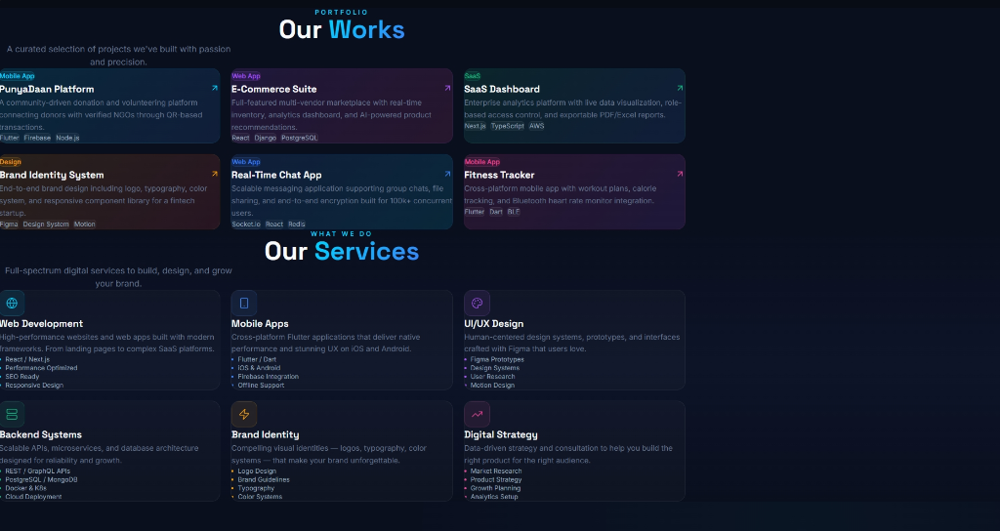
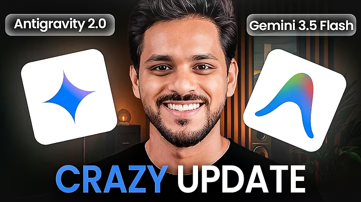
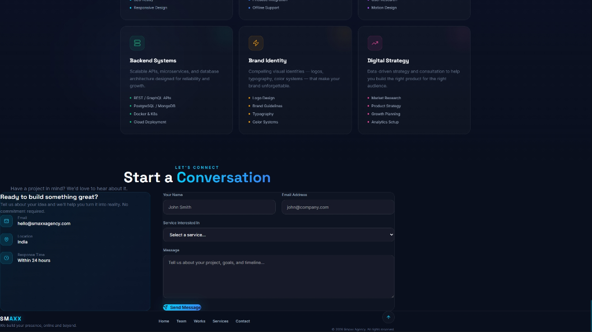

# SM★XX Agency — Website Portfolio

A state-of-the-art, animation-rich agency portfolio website built using **Vite + React 19 + Tailwind CSS v4 + GSAP (GreenSock)**. Designed for maximum visual impact, premium styling, fluid responsiveness, and high-performance cinematic presentation.

---

## 📸 Screenshots & Visual Preview

### 1. Cinematic Loading Screen
Featuring a randomized performance-based counter, elegant electric blue outer glowing logo, and an interactive loader track.


### 2. High-Impact Parallax Hero
Equipped with fluid parallax ambient orbs that follow cursor movements, bold Space Grotesk typography, and neon interactive call-to-actions.


### 3. Scroll-Snapping Team Showcases
A custom full-screen viewport snapping vertical slide deck. Member portraits are accompanied by elastic, slow-settling skill vector badges (such as Flutter, React, Figma, and Node.js) layered with three-dimensional depth effects.


### 4. Interactive Contact Form
A highly responsive feedback/inquiry module engineered with customized inline CSS elements, dynamic halo ambient glows, and state-based interactive indicators.


---

## ⚡ Key Features

* **Cinematic Snap Scroll Viewports**: Snap-alignment parameters force each expert slide in the **Team** block to cleanly capture and fill the browser viewport.
* **Elastic Back-Bounce badging**: Badges fly in organically from off-screen (`350px`) using GSAP's elastic `back.out` easing, then settle into a slow, calm floating animation loop.
* **Drawing Underline Links**: Sticky glassmorphism header navigation and footer panels feature active hover state tracking to cleanly draw glowing electric lines outwards from centerlines.
* **Premium Social Grid & Connect**: High-fidelity, circular social connections with scale, shift, and glowing outline transitions.
* **Favicon Branding**: Sleek custom glowing geometric **"S"** SVG vector icon set against a deep navy plate for premium styling in both browser light-mode and dark-mode tabs.
* **Ultra-Fast Builds**: Compiles for production distribution in less than **250ms** utilizing Vite's optimized bundler!

---

## 🛠️ Technology Stack

| Layer | Technology | Purpose |
|---|---|---|
| **Core** | React 19 & JavaScript | Component architecture, state hooks, and interaction |
| **Bundling** | Vite 8 | Superfast HMR and optimized asset compilation |
| **Styling** | Tailwind CSS v4 | Semantic grid spacing and dark-theme variables |
| **Motion** | GSAP 3 (ScrollTrigger) | Timeline choreographies and scroll-driven captures |
| **Icons** | Lucide React | Clean vector symbols for interactive CTA triggers |

---

## 📦 Getting Started

### Prerequisites
* [Node.js](https://nodejs.org) (v18.0.0 or higher recommended)
* npm (comes packaged with Node.js)

### Installation
1. Clone the repository:
   ```bash
   git clone https://github.com/YOUR_USERNAME/smaxx-agency.git
   cd smaxx-agency
   ```

2. Install all dependencies:
   ```bash
   npm install
   ```

3. Launch the development server:
   ```bash
   npm run dev
   ```
   Open `http://localhost:5173` in your browser.

### Building for Production
Vite compiles and compresses all assets (JS, CSS, SVGs, images) into a highly optimized, static bundle inside the `/dist` directory in less than a second:
```bash
npm run build
```
You can preview the production bundle locally with:
```bash
npm run preview
```

---

## 📁 File Structure

```text
smaxx-agency/
├── public/
│   ├── screenshots/       # Visual showcase assets
│   ├── favicon.svg        # Glowing geometric 'S' icon
│   └── icons.svg
├── src/
│   ├── assets/            # Team photos and vector skill svgs
│   ├── components/
│   │   ├── LoadingScreen.jsx
│   │   ├── Navbar.jsx
│   │   ├── Hero.jsx
│   │   ├── Team.jsx
│   │   ├── Works.jsx
│   │   ├── Services.jsx
│   │   ├── Contact.jsx
│   │   └── Footer.jsx
│   ├── App.jsx            # Parent orchestrator
│   ├── index.css          # Main styling variables
│   └── main.jsx
├── index.html             # Website root structure (Title, Favicon, Styles)
├── package.json
└── vite.config.js
```

---

## 🚀 Deployment (Vercel)

The codebase is 100% production-ready and fully compatible with **Vercel** out-of-the-box:
1. Connect your repository to Vercel.
2. Vercel automatically detects the **Vite** preset.
3. Keep default settings (`npm run build` and `/dist` output folder).
4. Click **Deploy**!

---

## ⚖️ License
Released under the MIT License. Created by Santhosh & the Smaxx Agency Developer Team.
